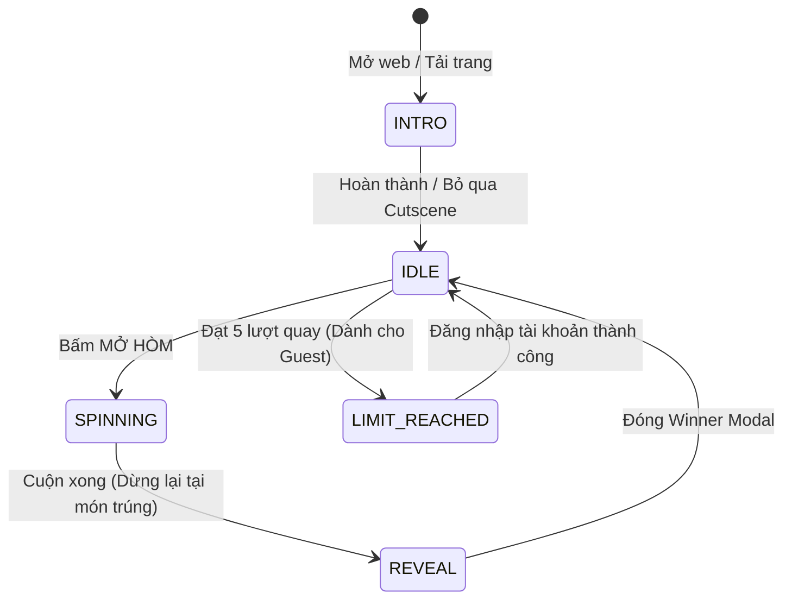

# 📜 SYSTEM ARCHITECTURE DOCUMENTATION
## Trưa Nay Ăn Gì — Captain CS2 Edition

> **Dự án**: `angiday_captain`  
> **Phiên bản**: `1.0.0 (Tactical Narrative Release)`  
> **Kiến trúc**: Next.js App Router (React 19) + Client-side Finite State Machine (`GameState`) + Firebase Authentication + TailwindCSS  
> **Mô hình triển khai**: Standalone Static Client-side Web Application  

---

## 🛠️ 1. TỔNG QUAN HỆ THỐNG (SYSTEM OVERVIEW)

Ứng dụng **"Trưa Nay Ăn Gì — Captain CS2 Edition"** là một web app độc lập dành cho môi trường văn phòng, kết hợp giữa cơ chế mở hòm vũ khí Counter-Strike 2 (CS2 Case Opening) và trải nghiệm nhập vai dẫn chuyện (Narrative Visual Novel) với sự trợ giúp của **Binh Nhất Trợ Lý**.

### Các đặc tính cốt lõi:
- **Zero-Backend Dependency**: Hoạt động hoàn toàn trên trình duyệt người dùng với Cookie/LocalStorage tự động lưu trữ cấu hình.
- **Firebase Auth**: Đăng nhập/Đăng ký nhanh qua Google hoặc Email/Password để kích hoạt đặc quyền mở hòm KHÔNG GIỚI HẠN.
- **60FPS - 144FPS Smooth Spin Reel**: Băng chuyền cuộn hòm được tối ưu hóa phần cứng GPU (translate3d) triệt tiêu hoàn toàn rác re-render.
- **Dual Narrative Intro Cutscenes**: Màn cutscene dẫn chuyện mở màn cá nhân hóa riêng biệt cho Guest (Tân Binh) và Member (Captain chính thức).

---

## 🕹️ 2. MÔ HÌNH QUẢN LÝ TRẠNG THÁI (GAMESTATE FSM & AUTH ENGINE)

Hệ thống được điều khiển bởi một **Máy Trạng Thái Hữu Hạn (Finite State Machine - FSM)** tinh gọn thông qua React Context API ([`GameContext.tsx`](file:///g:/Nextjs/angiday_captain/src/context/GameContext.tsx)):



### Chi tiết các Pha (Phases) trong `GameState`:

| Trạng thái (`GameState`) | Mô tả hành vi & Giao diện tương ứng |
| :--- | :--- |
| **`INTRO`** | Màn Cutscene dẫn chuyện Visual Novel làm mờ nền 100% (`backdrop-blur-xl`), hiển thị NPC Binh Nhất 2D Standee và đọc kịch bản phân loại theo Auth. |
| **`IDLE`** | Màn hình trực chiến chính sẵn sàng nhận lệnh. Binh Nhất hiển thị báo cáo Live trên đầu hòm mở. |
| **`SPINNING`** | Băng chuyền cuộn hòm quay ở tốc độ cao (âm thanh mở hòm & cuộn tiếng súng CS2). Nút Mở Hòm cố định kích thước `min-width: 290px`. |
| **`REVEAL`** | Xuất hiện `WinnerModal` vinh danh món ăn trúng thưởng kèm link đặt nhanh qua GrabFood & Google Maps. |
| **`LIMIT_REACHED`** | Áp dụng cho Guest đạt 5 lượt quay thử. Khóa nút quay và tự động kích hoạt `AuthModal`. |

---

## 🎭 3. HỆ THỐNG DẪN TRUYỆN & BIỂU CẢM NPC ĐỘNG (DYNAMIC NPC EMOTION ENGINE)

NPC **Binh Nhất Trợ Lý** được tích hợp bộ nhận diện cảm xúc động (Emotion Engine) giúp hoán đổi ảnh đại diện mượt mà theo từng lời thoại:

### Bộ 4 Ảnh Biểu Cảm Quân Sự CS2 (`public/npc/`):
1. **`happy`** ([`npc_happy.png`](file:///g:/Nextjs/angiday_captain/public/npc/npc_happy.png)): Tự hào giơ tay chào, vui vẻ chào mừng Captain.
2. **`serious`** ([`npc_serious.png`](file:///g:/Nextjs/angiday_captain/public/npc/npc_serious.png)): Nghiêm túc tập trung tác chiến khi hòm đang quay hoặc ra-da quét quán.
3. **`teasing`** ([`npc_teasing.png`](file:///g:/Nextjs/angiday_captain/public/npc/npc_teasing.png)): Nháy mắt trêu chọc khi Guest dùng hết 5 lượt quay thử.
4. **`shocked`** ([`npc_shocked.png`](file:///g:/Nextjs/angiday_captain/public/npc/npc_shocked.png)): Há hốc kinh ngạc khi trúng món cực phẩm **VÀNG / RARE / LEGENDARY**.

### Cấu trúc kịch bản Kép ([`introScript.ts`](file:///g:/Nextjs/angiday_captain/src/data/introScript.ts)):
- **`GUEST_INTRO_SCRIPT`**: Kịch bản báo cáo Tân binh, hướng dẫn 5 lượt quay thử và kéo chân đăng nhập.
- **`getMemberIntroScript(name)`**: Kịch bản báo cáo Chỉ huy chính thức, đọc tên Captain và xác nhận đặc quyền quay không giới hạn.

---

## 🎯 4. THUẬT TOÁN MỞ HÒM & XÁC SUẤT TRỌNG SỐ (SPIN MECHANICS)

Cơ chế quay chọn món dựa trên thuật toán **Weighted Random Selection** kết hợp hồ sơ cá nhân hóa ([`case-mechanics.ts`](file:///g:/Nextjs/angiday_captain/src/lib/case-mechanics.ts)):

1. **Lọc bể món ăn (Population Pool)**:
   - Loại bỏ các món bị tắt trong cấu hình hoặc món không phải Chay khi chọn chế độ Ăn Chay (`veg: true`).
2. **Tính toán trọng số ngân sách**:
   - Khoảng cách giữa giá món ăn và ngân sách mong muốn (VD: 35k, 50k, 75k, 100k, 150k) quyết định tỷ lệ rơi của món.
3. **Độ hiếm món ăn (Rarities)**:
   - **Phổ thông (Common - Xanh)**: Các món cơm bình dân, bún, phở quốc dân.
   - **Hiếm (Rare - Tím)**: Các món Lẩu cá nhân, Bít tết, Cơm niêu, Ramen.
   - **Cực hiếm (Legendary - Vàng)**: Sushi cá hồi, Lươn Nhật Unagi, Sườn nướng BBQ.

---

## 📁 5. CẤU TRÚC THƯ MỤC DỰ ÁN (DIRECTORY STRUCTURE)

```
angiday_captain/
├── public/
│   ├── brand/                  # Logo & Icon thương hiệu CS2
│   ├── npc/                    # Bộ 4 ảnh biểu cảm NPC Binh Nhất (.png)
│   │   ├── npc_happy.png
│   │   ├── npc_serious.png
│   │   ├── npc_teasing.png
│   │   └── npc_shocked.png
│   ├── sounds/                 # Hiệu ứng âm thanh CS2 (Crate open, reveal)
│   └── food-*.webp             # Các file Sprite Sheet Atlas ảnh món ăn
├── src/
│   ├── app/
│   │   ├── layout.tsx          # Root Layout & Theme Configuration
│   │   ├── page.tsx            # Trang chủ Mở Hòm (Home Route)
│   │   ├── profile/            # Trang Hồ Sơ Captain (Profile Route)
│   │   └── globals.css         # CSS Tokens, Hardware Acceleration & CS2 Theme
│   ├── components/
│   │   ├── auth/               # Modal Đăng nhập / Đăng ký CS2 (AuthModal)
│   │   ├── captain/            # Khung báo cáo NPC Binh Nhất Live (CaptainAvatar)
│   │   ├── case-app/           # Component điều phối chính (CaseApp)
│   │   ├── control-bar/        # Thanh tùy chỉnh ngân sách & nút quay (ControlBar)
│   │   ├── food-card/          # Thẻ hiển thị món ăn CS2 (FoodCard)
│   │   ├── header/             # Thanh Điều Hướng & Badge Team (Header)
│   │   ├── intro-story/        # Màn Dẫn Truyện Visual Novel (IntroStory)
│   │   ├── inventory/          # Bảng danh mục 131 món ăn (InventoryGrid)
│   │   ├── spin-reel/          # Băng chuyền cuộn hòm GPU 60fps (SpinReel)
│   │   └── winner-modal/       # Popup vinh danh chiến thắng (WinnerModal)
│   ├── context/
│   │   ├── AuthContext.tsx     # Firebase Authentication Provider
│   │   └── GameContext.tsx     # GameState Finite State Machine Provider
│   ├── data/
│   │   ├── barkLines.ts        # Danh sách lời thoại NPC kèm nhãn emotion
│   │   └── introScript.ts      # Kịch bản Dẫn truyện Kép (Guest & Member)
│   ├── hooks/
│   │   └── use-local-spin-count.ts  # Theo dõi giới hạn 5 lượt quay cho Guest
│   ├── lib/
│   │   ├── case-audio.ts       # Trình phát âm thanh WebAudio API
│   │   ├── case-mechanics.ts   # Thuật toán quay & tính toán chuyển động
│   │   ├── firebase.ts         # Khởi tạo Firebase SDK (SSR Safe)
│   │   └── foods.ts            # Cơ sở dữ liệu 131 món ăn văn phòng
│   └── types/
│       └── index.ts            # Kiểu dữ liệu TypeScript (GameState, BarkLine, Food)
├── System.md                   # Tài liệu kiến trúc chi tiết (File này)
└── package.json
```

---

## 🔒 6. QUY ĐỊNH BẢO MẬT & TRIỂN KHAI (COMMUNITY & LOCAL POLICY)

- **Local First & Privacy**: Ứng dụng chạy hoàn toàn local trên môi trường browser người dùng. Cookie được mã hóa an toàn và chỉ lưu trên máy chủ cục bộ.
- **Không tự ý gọi API bên ngoài**: Chỉ các liên kết ngoài do người dùng chủ động nhấp (Google Maps, GrabFood) mới rời khỏi ứng dụng. Mọi tài nguyên âm thanh và hình ảnh NPC đều được lưu cục bộ trong `public/`.
